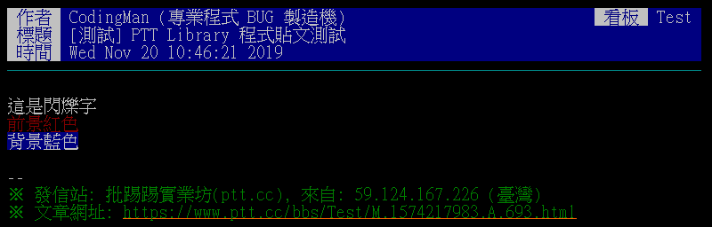

使用範例
=============
| 這裡記錄了各種實際使用的範例 ☺️

保持登入
--------
這裡示範了如何保持登入

.. code-block:: python

    import PyPtt

    def login():
        max_retry = 5

        ptt_bot = None
        for retry_time in range(max_retry):
            try:
                ptt_bot = PyPtt.API()

                ptt_bot.login('YOUR_ID', 'YOUR_PW',
                    kick_other_session=False if retry_time == 0 else True)
                break
            except PyPtt.exceptions.LoginError:
                ptt_bot = None
                print('登入失敗')
                time.sleep(3)
            except PyPtt.exceptions.LoginTooOften:
                ptt_bot = None
                print('請稍後再試')
                time.sleep(60)
            except PyPtt.exceptions.WrongIDorPassword:
                print('帳號密碼錯誤')
                raise
            except Exception as e:
                print('其他錯誤:', e)
                break

        return ptt_bot

    if __name__ == '__main__':
        login()

        last_newest_index = ptt_bot.get_newest_index()
        time.sleep(60)

        try:
            while True:

                try:
                    newest_index = ptt_bot.get_newest_index()
                except PyPtt.exceptions.ConnectionClosed:
                    ptt_bot = login()
                    continue
                except Exception as e:
                    print('其他錯誤:', e)
                    break

                if newest_index == last_newest_index:
                    continue

                print('有新文章!', newest_index)

                # do something

                time.sleep(5)
        finally:
            ptt_bot.logout()

幫你的文章上色
--------------
如果在發的時候有上色的需求，可以透過模擬鍵盤輸入的方式達到加上色碼的效果

.. code-block:: python

    import PyPtt

    content = [
        PTT.command.Ctrl_C + PTT.command.Left + '5' + PTT.command.Right + '這是閃爍字' + PTT.command.Ctrl_C,
        PTT.command.Ctrl_C + PTT.command.Left + '31' + PTT.command.Right + '前景紅色' + PTT.command.Ctrl_C,
        PTT.command.Ctrl_C + PTT.command.Left + '44' + PTT.command.Right + '背景藍色' + PTT.command.Ctrl_C,
    ]
    content = '\n'.join(content)

    ptt_bot = PyPtt.API()
    try:
        # .. login ..
        ptt_bot.post(board='Test', title_index=1, title='PyPtt 程式貼文測試', content=content, sign_file=0)
    finally:
        ptt_bot.logout()

.. _check_post_status:

如何判斷文章資料是否可以使用
------------------------------
當 :doc:`api/get_post` 回傳文章資料回來時，這時需要一些判斷來決定是否要使用這些資料

.. code-block:: python

    import PyPtt

    ptt_bot = PyPtt.API()
    try:
        # .. login ..
        post_info = ptt_bot.get_post('Python', index=1)

        print(post_info)

        if post_info[PyPtt.PostField.post_status] == PyPtt.PostStatus.EXISTS:
            print('文章存在！')
        elif post_info[PyPtt.PostField.post_status] == PyPtt.PostStatus.DELETED_BY_AUTHOR:
            print('文章被作者刪除')
            sys.exit()
        elif post_info[PyPtt.PostField.post_status] == PyPtt.PostStatus.DELETED_BY_MODERATOR:
            print('文章被版主刪除')
            sys.exit()

        if not post_info[PyPtt.PostField.pass_format_check]:
            print('未通過格式檢查')
            sys.exit()

        print('文章資料可以使用')
    finally:
        ptt_bot.logout()
